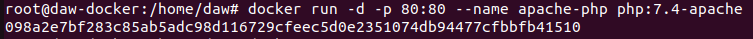

# Tarea 2 - Imágenes - curso Docker - IESGN
> Realizado por Pablo R.

- **1. Descarga las siguientes imágenes: ubuntu:18.04, httpd, tomcat:9.0.39-jdk11,jenkins/jenkins:lts, php:7.4-apache.**

    ```sh
    docker pull ubuntu:18.04
    docker pull httpd
    docker pull tomcat:9.0.39-jdk11
    docker pull jenkins/jenkins:lts
    docker pull php:7.4-apache
    ```
    
    
    Descargamos las imagenes en el sistema.
   
    
-  **2. Muestra las imágenes que tienes descargadas.**
 
    ```sh
    docker images
    ```
    Comprobamos que estén correctamente descargadas.
    
    
    
- **3. Crea un contenedor demonio con la imagen php:7.4-apache.**

    ```sh
    docker run -d -p 80:80 --name apache-php -v "$PWD":/var/www/html php:7.4-apache
    ```
    Creamos la imagen docker con php, y observamos que se visualiza correctamente en el navegador.
    
    
    
    
    
- **4. Comprueba el tamaño del contenedor en el disco duro.**
    ```sh
    docker ps -a -s
    ```
    Comprobamos que el tamaño del cotenedor es de 453MB siendo 2B virtuales.
    
    
     
 - **5. Con la instrucción docker cp podemos copiar ficheros a o desde un contenedor. Puedes encontrar información es esta página. Crea un fichero en tu ordenador, con el siguiente contenido.**
    ```sh
    nano /home/daw/info.php
    ```
    ```php
    <?php
        echo phpinfo();
    ?>
    ```
    Creamos el fichero info.php con el código php en nuestra máquina host.
    
    
    
    
    ```sh
        docker cp /home/daw/info.php apache-php:/var/www/html
    ```
    Copiamos el archivo info.php a /var/www/html de la maquina docker.
    
    