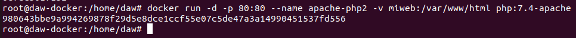

# Tarea 3 - Almacenamiento en Docker - IESGN
> Realizado por Pablo R.

**Vamos a trabajar con volúmenes docker:**

- **1. Crear un volumen docker que se llame miweb.**
    ```sh
        docker volume create miweb
    ```
    
    
    Creamos el volumen mi web.
    
- **2. Crea un contenedor desde la imagen php:7.4-apache donde montes en el directorio/var/www/html (que sabemos que es el DocumentRoot del servidor que nos ofrece esa imagen) el volumen docker que has creado.**
    ```sh
        docker run -d -p 80:80 --name apache-php2 -v miweb:/var/www/html php:7.4-apache
    ```
    
    
    Creamos el php asociado al volumen miweb.

- **3. Utiliza el comando docker cp para copiar un fichero index.html en el directorio /var/www/html.**
    ```sh
        nano /home/daw/index.html
        docker cp /home/daw/index.html apache-php2:/var/www/html
    ```
    
    
    
    
    
    Creamos el archivo index.html en nuestro equipos con nano y copiamos dicho fichero a la máquina docker.

Copiamos el archivo index.html al contenedor.
- **4. Accede al contenedor desde el navegador para ver la información ofrecida por el fichero index.html.**
    ```sh
        docker start apache-php2
    ```
    
    
    
    
    Iniciamos el contenedor y accedemos por el navegador.
    
- **5. Borra el contenedor**
    ```sh
    docker stop <id_contenedor>
    docker rm <id_contenedor>
    ```
    
    
    
    Paramos el contenedor y lo eliminamos el contenedor.

- **6. Crea un nuevo contenedor y monta el mismo volumen como en el ejercicio anterior.**

- **7. Accede al contenedor desde el navegador para ver la información ofrecida por el ficheroindex.html. ¿Seguía existiendo ese fichero?**

    **Vamos a trabajar con bind mount:**

- **1. Crea un directorio en tu host y dentro crea un fichero index.html.**

- **2. Crea un contenedor desde la imagen php:7.4-apache donde montes en el directorio/var/www/html el directorio que has creado por medio de bind mount.**

- **3. Accede al contenedor desde el navegador para ver la información ofrecida por el ficheroindex.html.**

- **4. Modifica el contenido del fichero index.html en tu host y comprueba que al refrescar lapágina ofrecida por el contenedor, el contenido ha cambiado.**

- **5. Borra el contenedor**

- **6. Crea un nuevo contenedor y monta el mismo directorio como en el ejercicio anterior.**

- **7. Accede al contenedor desde el navegador para ver la información ofrecida por el ficheroindex.html. ¿Se sigue viendo el mismo contenido?**