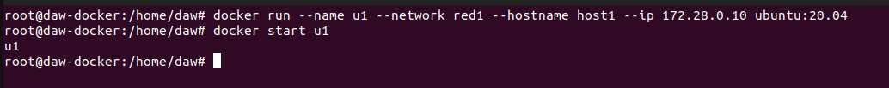
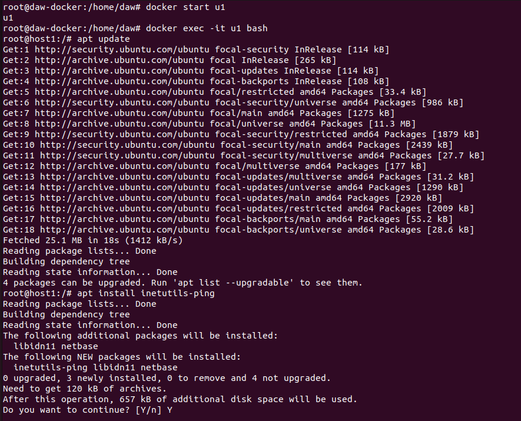
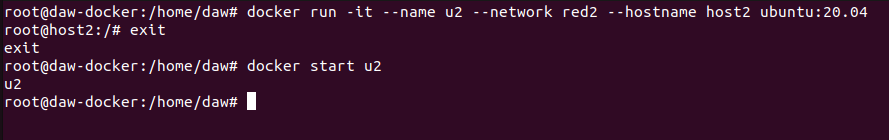
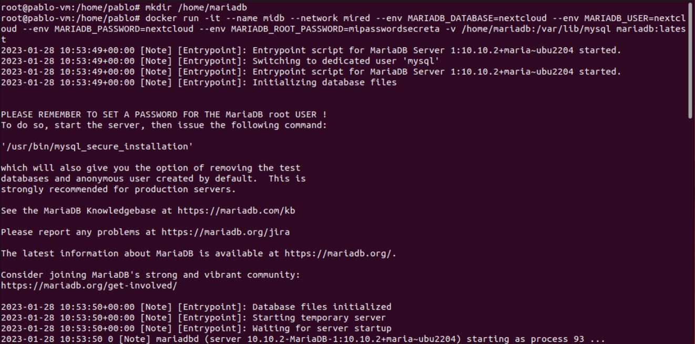

# Tarea 4 - Reder en docker
> Realizado por Pablo R.

1. **Vamos a crear dos redes de tipo bridge con los siguientes datos:**
    - Red 1
        - Nombre: red1
        - Dirección de red: 172.28.0.0
        - Máscara de red: 255.255.0.0
        - Gateway: 172.28.0.1
    - Red 2
        - Nombre: red2
        - El resto de los datos serán proporcionados automáticamente por Docker.
        
        ```sh
            docker network create red1 --subnet 172.28.0.0/16 --gateway 172.28.0.1
            docker network create red2
        ```
        
        
        
        Creamos las redes que se nos pide.
    
2. **Poner en ejecución un contenedor de la imagen ubuntu:20.04 que tenga como hostname host1, como IP 172.28.0.10 y que esté conectado a la red1. Lo llamaremos u1.**
        
    ```sh
        docker run -it --name u1 --network red1 --hostname host1 --ip 172.28.0.10 ubuntu:20.04
        docker start u1
    ```
    
    
    
    Creamos el contenedor con la red1 y la ip proporconada en el ejercicio.
    
3. **Entrar en ese contenedor e instalar la aplicacion ping ( apt update && apt install inetutils-ping).**

    ```sh
        docker exec -it u1 bash
        apt update
        apt install inetutils-ping
    ```
    
    
    
    Iniciamos el contenedor, entramos por bash e instalamos la herramienta ping.
    
4. **Poner en ejecución un contenedor de la imagen ubuntu:20.04 que tenga como hostname host2 y que esté conectado a la red2. En este caso será docker el que le de una IP correspondiente a esa red. Lo llamaremos u2.**

    ```sh
        docker run -it --name u2 --network red2 --hsotname host2 ubuntu:20.04
        docker start u2
    ```
    
    
    
    Ponemos en ejecución la segunda máquina.
    
5. **Entrar en ese contenedor e instalar la aplicación ping (apt update && apt install ineutils-ping)**.

    ```sh
        docker exec -it u2 bash
        apt update
        apt install inetutils-ping
    ```
    
    
    
    Instalamos la herramienta ping.
    

**PANTALLAZOS. Pantallazos.**

- Pantallazo donde se vea la configuración del contenedor u1.

```sh
    docker inspect u1
```

- Pantallazo donde se vea la configuración del contenedor u2.


```sh
    docker inspect u2
```


- Pantallazo donde desde cualquiera de los dos contenedores se peuda ver no hacemos ping al otro ni por ip ni por nombre.

```sh
    docker exec -it u1 bash
    ping u2
    ping 172.19.0.2
```


Intentamos hacer ping desde u1 a u2.

- Pantallazo donde se pueda comprobar que si conectamos el contenedor u1 a la red2 (con docker network connect), desde el contenedor u1, tenemos al contenedor u2 mediante ping, tanto por nombre como por ip.

```sh
    docker network connect red2 u1
```


**Despliegue de Nextcloud + mariadb/postgreSQL**

Vamos a desplegar la aplicación nextcloud con una base de datos (puedes elegir mariadb o PostgreSQL) (NOTA: Para que no te de errores utiliza la imagen mariadb:10.5 ). Te puede servir el ejercicio que hemos realizado para desplegar Wordpress . Para ello sigue los siguientes pasos:

1. **Crea una red de tipo bridge.** 

   ```sh
   docker network create mired
   ```

   

   Creamos la red bridge.

   

2. **Crea el contenedor de la base de datos conectado a la red que has creado. La base de datos se debe configurar para crear una base de datos y un usuario. Además el contenedor debe utilizar almacenamiento (volúmenes o bind mount) para guardar la información. Puedes seguir la documentación de mariadb o la de PostgreSQL .** 

   ```sh
   mkdir /home/mariadb
   docker run -it --name midb --network mired --env MARIADB_DATABASE=nextcloud --e MARIADB_USER=nextcloud --env MARIADB_PASSWORD=nextcloud MARIADB_ROOT_PASSWORD=mipasswordsecreta -v /home/mariadb:/var/lib/mysql mariadb:latest
   ```

   

   Inicializamos la bd.

3. **A continuación, siguiendo la documentación de la imagen nextcloud , crea un contenedor conectado a la misma red, e indica las variables adecuadas para que se configure de forma adecuada y realice la conexión a la base de datos. El contenedor también debe ser persistente usando almacenamiento.** 

   ```sh
   mkdir /home/nextcloud
   docker run -d -v /home/nextcloud:/var/www/html --network mired  --env MYSQL_HOST=midb --env MYSQL_DATABASE=nextcloud --env MYSQL_USER=nextcloud --env MYSQL_PASSWORD=mipassword nextcloud
   ```

   

   Inicializamos nextcloud.

4. **Accede a la aplicación usando un navegador web. **


**El documento debe contener, además, los siguientes pantallazos: Pantallazo con la instrucción para crear el contenedor de la base de datos. Pantallazo con la instrucción para crear el contenedor de la aplicación. Pantallazo donde se ve el acceso a la aplicación desde un navegador web.**
